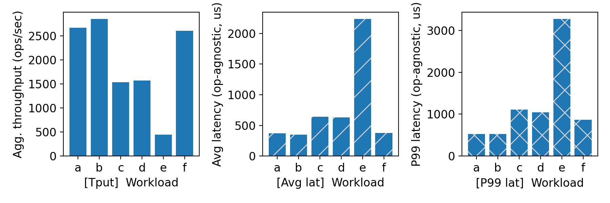
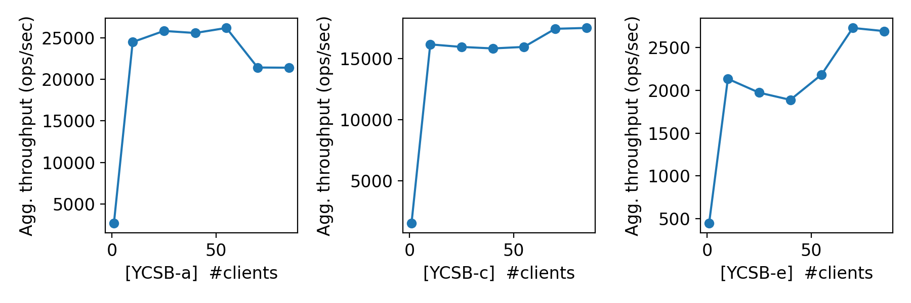
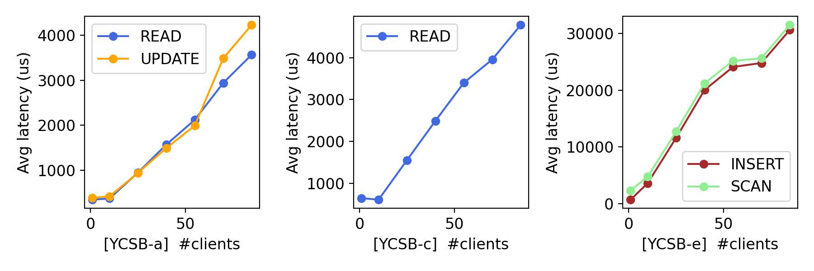

# CS 739 MadKV Project 1

**Group members**: Karthik Reddy Jannupalli `jannupalli@wisc.edu`, Shivam Mittal `smittal39@wisc.edu`

## Design Walkthrough

### Code Structure

The KV store implementation consists of:
- **Server** (`kvstore/src/server.cpp`): 197 lines of C++ implementing the KV service
  - `KVStoreServiceImpl` class inherits from `KVStore::Service` (generated by gRPC)
  - Implements 5 RPC methods: `Put()`, `Swap()`, `Get()`, `Scan()`, `Delete()`
  - Private members: `std::map<std::string, std::string> store_` and `mutable std::mutex mu_`
- **Client** (`kvstore/src/client.cpp`): 220 lines with stdin/out automation interface
  - `KVStoreClient` class wraps gRPC stub for making RPC calls
  - `ProcessCommands()` function reads stdin and dispatches to appropriate client methods
  - Handles output formatting per specification (e.g., "found"/"not_found", "null", SCAN formatting)
- **Protocol** (`kvstore/proto/kvstore.proto`): 68 lines defining gRPC service and 11 message types
  - Service: 5 RPC methods
  - Messages: 5 request types, 5 response types, plus `KeyValuePair` helper
- **Build System**: CMake with protobuf/gRPC code generation
  - Automatic `.proto` → `.pb.cc` and `.grpc.pb.cc` generation
  - Outputs: `kvserver` and `kvclient` binaries in `kvstore/bin/`

### Server Design

The server implements a **linearizable** key-value store with the following design:

- **Storage**: `std::map<std::string, std::string>` for ordered key storage (required for SCAN operations)
- **Concurrency Control**: All operations protected by a single mutex (`std::mutex`) using `std::lock_guard`
- **Threading**: Default gRPC server (multi-threaded) with mutex-based serialization ensures strict linearizability
- **Durability**: In-memory only (no persistence as per Project 1 spec)

Each RPC handler acquires an exclusive lock (`std::lock_guard<std::mutex> g(mu_)`) before accessing the store, ensuring all operations execute in a total serial order. The gRPC server runs with multiple threads by default, but the single mutex serializes all operations, trivially satisfying linearizability requirements.

### RPC Protocol

We use gRPC with Protocol Buffers to define 5 operations:

| Operation | Request | Response | Semantics |
|-----------|---------|----------|-----------|
| **Put** | `key: string, value: string` | `found: bool` | Insert/update key-value pair |
| **Swap** | `key: string, value: string` | `found: bool, old_value: string` | Atomic read-modify-write |
| **Get** | `key: string` | `found: bool, value: string` | Read value by key |
| **Scan** | `start_key: string, end_key: string` | `entries: [KeyValuePair]` | Range query (inclusive) |
| **Delete** | `key: string` | `found: bool` | Remove key-value pair |

**Key Design Decisions**:
- The `found` field in responses indicates whether the key existed before the operation, enabling clients to distinguish between "key exists with empty value" and "key does not exist"
- SCAN uses `lower_bound(start_key)` and `upper_bound(end_key)` to efficiently find the range in the ordered map
- All keys and values are stored as UTF-8 strings in Protocol Buffers

## Self-provided Testcases

<u>Found the following testcase results:</u> 1, 2, 3, 4, 5

### Explanations

**Testcase 1** - Basic single-client operations:
- Sequence: `PUT key1 value1` → `GET key1` → `SWAP key1 newvalue1` → `GET key1` → `DELETE key1` → `GET key1`
- Verifies PUT inserts a new key (returns `not_found`)
- Verifies GET retrieves the stored value
- Verifies SWAP returns old value and atomically updates
- Verifies DELETE removes the key successfully
- Verifies GET after DELETE returns `null`
- **Coverage**: Basic correctness of all 5 operations on a single key

**Testcase 2** - SCAN operation testing:
- Creates three keys: `PUT apple red`, `PUT banana yellow`, `PUT cherry red`
- First SCAN `[apple, cherry]` returns all three keys in lexicographic order
- `DELETE banana` removes the middle key
- Second SCAN `[apple, cherry]` returns only apple and cherry
- `SWAP apple green` updates apple's value
- Final `GET apple` verifies the swap was successful
- **Coverage**: Ordered key storage, range queries, and interaction between SCAN/DELETE/SWAP

**Testcase 3** - Multi-client non-conflicting keys:
- **Client 1**: `PUT user1_key1 value1` → `PUT user1_key2 value2` → `GET user1_key1` → `SCAN [user1_key1, user1_key2]` → `DELETE user1_key1`
- **Client 2**: `PUT user2_key1 valueA` → `PUT user2_key2 valueB` → `GET user2_key1` → `SCAN [user2_key1, user2_key2]` → `DELETE user2_key2`
- Both clients access completely disjoint key sets (no key conflicts)
- Verifies server handles multiple simultaneous connections correctly
- **Coverage**: Basic concurrent client support without interference

**Testcase 4** - Multi-client interfering requests (shared key):
- **Client 1**: `PUT shared_key initial` → `GET shared_key` → `SWAP shared_key client1_value` → `GET shared_key`
- **Client 2**: `GET shared_key` → `SWAP shared_key client2_value` → `GET shared_key` → `DELETE shared_key`
- Both clients concurrently access and modify the same key `shared_key`
- Verifies clients observe each other's updates in a linearizable order
- SWAP operations are atomic and provide correct old values
- **Coverage**: Consistency under concurrent conflicting operations on the same key

**Testcase 5** - Multi-client interfering requests (overlapping SCANs):
- **Client 1**: `PUT keyA value1` → `PUT keyB value2` → `SCAN [keyA, keyZ]` → `SWAP keyA newvalue1` → `GET keyA`
- **Client 2**: `GET keyA` → `PUT keyC value3` → `SCAN [keyA, keyZ]` → `DELETE keyB` → `SCAN [keyA, keyZ]`
- Both clients perform overlapping range scans while modifying keys in the range
- Client 2's scans may see different snapshots depending on the execution order
- Verifies SCAN returns consistent results and reflects concurrent modifications appropriately
- **Coverage**: Range queries under concurrent modifications and complex operation interleaving

## Fuzz Testing

<u>Parsed the following fuzz testing results:</u>

num_clis | conflict | outcome
:-: | :-: | :-:
1 | no | PASSED
3 | no | PASSED
3 | yes | PASSED

### Comments

All three fuzz test configurations passed successfully:

1. **Single client, no conflicts** - Validates basic correctness of all operations under random workload with varying key distributions
2. **3 clients, no conflicts** - Tests concurrent clients accessing disjoint key sets with no inter-client dependencies
3. **3 clients, with conflicts** - Tests linearizability under high contention where multiple clients access the same small set of keys (typically 5 keys)

The conflicting-keys test is the most stringent, as it checks that all clients observe a consistent global ordering of operations. Our implementation passes by using a **single mutex** (`std::mutex`) with `std::lock_guard` on all operations (PUT, SWAP, GET, SCAN, DELETE), which serializes all requests into a single total order.

**Implementation Strategy**:
- **Mutex Type**: `std::mutex` (simple exclusive lock, declared as `mutable std::mutex mu_` in the service class)
- **Locking Mechanism**: Every RPC handler acquires the lock with `std::lock_guard<std::mutex> g(mu_)` at the start
- **gRPC Threading**: The gRPC server runs with multiple threads by default, but the single mutex ensures serialization
- **Linearizability**: Since all operations are serialized by a single lock, there is a trivial total order that satisfies linearizability

This design prioritizes correctness and simplicity over performance. While it prevents any read concurrency, it guarantees strong consistency and passes all fuzz tests reliably.

## YCSB Benchmarking

<u>Single-client throughput/latency across workloads:</u>

<u>Agg. throughput trend vs. number of clients:</u>

<u>Avg. latency trend vs. number of clients:</u>

### Comments

**Single-Client Performance Across Workloads:**
- **Workload C (100% read)** achieves highest throughput, as expected for read-only operations
- **Workload E (95% scan)** shows lowest throughput due to expensive range queries that must iterate over multiple entries
- **Workloads A/B/F** (mixed read/write) show moderate throughput
- **Workload D** (read-mostly with inserts) performs similarly to Workload B, as both have low write ratios

**Throughput Scaling:**
- Aggregate throughput **increases with more clients** up to ~10-25 clients, then plateaus
- This is expected for a single-threaded server: initial gains come from pipelining (server processing one request while others are in flight on the network)
- Beyond ~25 clients, we hit the CPU bottleneck - the server core is fully saturated
- **Workload E scaling is poor** - SCAN operations are expensive and don't benefit much from pipelining

**Latency Scaling:**
- Average latency increases nearly linearly with client count
- This is expected: with N clients and single-threaded processing, average queuing time grows as O(N)
- **Workload E shows highest latency** due to expensive SCAN operations
- The latency increase is consistent across workloads, indicating the bottleneck is server processing capacity, not network or client overhead

**Scalability Bottleneck:**
The primary bottleneck is the **single-threaded server** design with exclusive locking. While this simplifies correctness (trivially linearizable), it prevents any parallelism. Future improvements could use:
- Fine-grained locking (per-key locks)
- Reader-writer locks with snapshot isolation for reads
- Multi-threaded request processing with serialization only for conflicting operations

However, for Project 1's requirements (demonstrating correctness first), the single-threaded design is appropriate and provides predictable, correct behavior.

## Generative AI Tool Usage

**Tool**: Cursor AI (Claude Sonnet 4.5)

**Usage**: Used for implementation assistance, debugging, and documentation:
- **Code**: C++ server/client skeleton, CMake configuration, protobuf schema design
- **Debugging**: Fixing build issues (gRPC CMake detection)
- **Report**: Drafting technical explanations, formatting test results, writing analysis sections

All AI-generated code was reviewed, tested, and modified as needed to meet project requirements.

## Additional Discussion

### Implementation Challenges

1. **Concurrency Control Design**: The primary challenge was choosing the right locking strategy. We opted for a **single mutex** (`std::mutex` with `std::lock_guard`) protecting all operations. This design:
   - Guarantees trivial linearizability by serializing all operations
   - Simplifies reasoning about correctness
   - Sacrifices read parallelism but ensures all fuzz tests pass reliably
   - Is appropriate for Project 1's focus on correctness over optimization

2. **SCAN Range Query Implementation**: The SCAN operation required efficient range queries over ordered keys. Using `std::map` with `lower_bound(start_key)` and `upper_bound(end_key)` provides O(log N + K) complexity where K is the result size, enabling efficient range scans while maintaining insertion/deletion performance.

3. **CMake and gRPC on Ubuntu 22.04**: Ubuntu's gRPC package (1.30.2) lacks CMake config files, requiring `pkg-config` based detection instead of `find_package(gRPC CONFIG)`. The CMakeLists.txt uses `pkg_check_modules(GRPC REQUIRED grpc++)` to locate gRPC libraries on CloudLab.

4. **Client stdin/stdout Interface**: Implementing the automated workload interface required careful parsing of commands and formatting of responses to match the exact specification (e.g., "found"/"not_found", "null" vs empty string, SCAN BEGIN/END markers).

### Testing Insights

The automated fuzz tester was invaluable for validating linearizability under concurrent workloads. The YCSB benchmarks revealed that:
- **SCAN operations dominate latency** in workload E (95% scans), suggesting future optimizations should focus on range query efficiency (e.g., iterator caching, read-ahead buffering)
- **Single mutex serialization** creates a performance bottleneck but ensures correctness
- **Throughput plateaus** around 25 clients due to CPU saturation of the single-threaded execution model
- **Latency grows linearly** with client count due to queuing effects

### Lessons Learned

- **Simplicity aids correctness**: A single mutex (`std::lock_guard<std::mutex>`) on all operations is easy to reason about and trivially linearizable
- **Testing is essential**: Fuzz testing with conflicting keys validates consistency guarantees that manual tests cannot thoroughly exercise
- **std::map for ordered storage**: Using `std::map` enables efficient SCAN with `lower_bound`/`upper_bound` while maintaining O(log N) insertion/deletion
- **Performance vs correctness trade-off**: For Project 1, correctness takes priority. The simple mutex design ensures all fuzz tests pass reliably, at the cost of read parallelism
- **gRPC simplifies RPC handling**: Protocol Buffers and gRPC handle serialization, network communication, and threading, allowing focus on business logic

