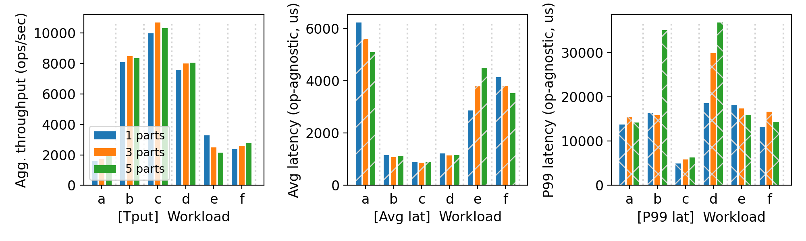
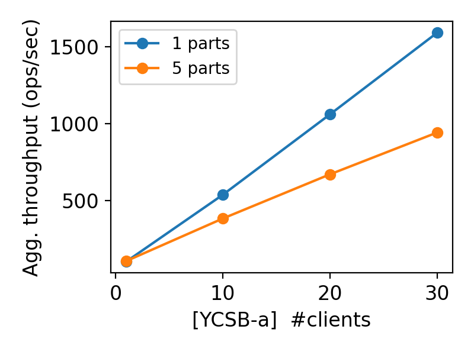

# CS 739 MadKV Project 2

**Group members**: Karthik Reddy Jannupalli `jannupalli@wisc.edu`, Shivam Mittal `smittal39@wisc.edu`

## Design Walkthrough

We implemented Project 2 by extending our Project 1 gRPC KV store into a partitioned, durable service with three binaries: `kvmanager`, `kvserver`, and `kvclient`.

**Code components structure.**  
`kvmanager` tracks cluster membership and partition assignment metadata. `kvserver` owns one partition, persists data in RocksDB under its assigned backer directory, and serves KV RPCs. `kvclient` starts from manager metadata, builds connections to all partition servers, routes single-key operations by a stable hash (`FNV-1a`), and fans out `SCAN` to all partitions before merging by key.

**Durability/recovery design & implementation.**  
Each server uses a dedicated RocksDB instance at `<backer_path>`. For mutating operations (`PUT`, `SWAP`, `DELETE`), we use synchronous writes (`WriteOptions.sync = true`) before returning success to the client. Recovery is automatic: restarting a server process with the same backer path reopens the same RocksDB state, so acknowledged writes survive process crashes.

**Partitioning design & manager implementation.**  
The manager is launched with the expected server address list. Server IDs map 1:1 to partition IDs for a fixed partitioning layout in this project. Servers register with manager at startup and wait until cluster readiness. Clients fetch cluster metadata from manager and then issue requests directly to partition servers (manager is not on the hot path after bootstrap).

**Error and timeout handling.**  
All cross-component RPC paths use retry loops with short backoff: server->manager registration, client->manager metadata fetch, and client->server operations. If a server is temporarily unavailable, clients keep retrying until the server is back. This behavior is what allows crash/recovery fuzz scenarios to continue without manual client restarts.

## Self-provided Testcase

You will run the described testcase during demo time.

### Explanations

Our deterministic testcase follows the project spec sequence:

1. Launch manager + 3 partition servers (`s0,s1,s2`).
2. Issue multiple `PUT` and `SWAP` operations across keys that map to different partitions.
3. Validate with successful `GET` and `SCAN`.
4. Kill one partition server (we used `s1`).
5. Confirm unaffected-partition `GET`/`SCAN` still succeed.
6. Confirm a request involving the failed partition blocks/fails until recovery.
7. Restart the failed partition server with the same backer path.
8. Re-run `GET` on existing keys from that partition and confirm latest values are preserved.

This testcase directly validates both partition isolation and durable crash recovery.

## Fuzz Testing

<u>Parsed the following fuzz testing results:</u>

num_servers | crashing | outcome
:-: | :-: | :-:
3 | no | PASSED
3 | yes | PASSED
5 | yes | PASSED

You will run a crashing/recovering fuzz test during demo time.

### Comments

All three required fuzz scenarios passed:

- `3 servers, no crash`: passed consistently.
- `3 servers, with crash/recovery`: passed; clients stalled briefly during outage and resumed after restart.
- `5 servers, with dual crash/recovery`: passed with the same retry/recovery logic.

These runs validated two important properties in our implementation:  
(1) client retry behavior is robust under transient server failures, and  
(2) durable state survives server restarts when the same backer directories are reused.

## YCSB Benchmarking

<u>10 clients throughput/latency across workloads & number of partitions:</u>

<u>Agg. throughput trend vs. number of clients w/ and w/o partitioning:</u>

### Comments

Observed trends from our collected logs:

- For `10` clients, throughput improves as partitions increase from `1 -> 3 -> 5` for all workloads A-F.  
  Example (ops/sec):  
  - Workload A: `332.29 -> 410.04 -> 484.28`  
  - Workload C: `334.49 -> 413.17 -> 543.11`  
  - Workload F: `335.47 -> 404.85 -> 503.72`
- For workload A client scaling, `5` partitions scale much better than `1` partition at moderate/high concurrency:  
  - `1 partition` (1,10,20,30 clients): `325.74, 332.29, 337.66, 341.89`  
  - `5 partitions` (1,10,20,30 clients): `296.54, 484.28, 522.21, 512.60`
- At very low concurrency (`1` client), partitioning adds overhead (extra manager/bootstrap + distributed routing), so `5` partitions can be slightly lower than `1`.
- As concurrency rises, partitioning reduces server-side contention and increases aggregate throughput, which is the main expected Project 2 benefit.

## Additional Discussion

**Physical setup used for testing/benchmarking.**  
We ran all required scenarios on a single machine with multiple local processes bound to different ports. This keeps the relative trend analysis meaningful while fitting local resource constraints.

**Current limitations / future improvements.**  
Manager is still a single point of failure (as expected for Project 2). `SCAN` is implemented as a cross-partition fan-out merge and is not globally atomic, matching the spec's relaxed scan consistency requirement for this stage.

