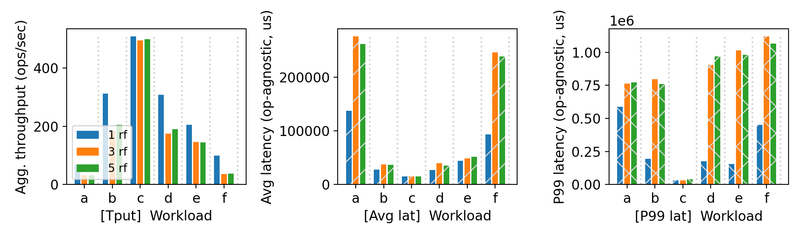
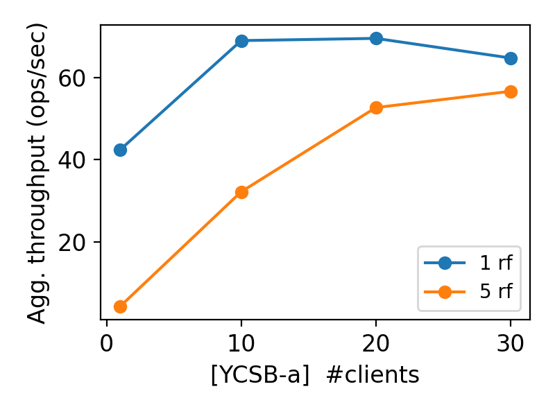

# CS 739 MadKV Project 3

**Group members**: Karthik Reddy Jannupalli `jannupalli@wisc.edu`, Shivam Mittal `smittal39@wisc.edu`

## Design Walkthrough

### Architecture Overview

MadKV P3 adds **Raft-based replication** on top of the P2 key-value server, providing fault tolerance against up to ⌊(RF−1)/2⌋ simultaneous server crashes while maintaining linearizable reads and writes.

The system has two components:

- **Manager (`kvmanager`)**: A single-node metadata server. It accepts `RegisterServer` RPCs from replica nodes and serves `GetCluster` RPCs to clients so they can discover partition leaders.
- **KV Server (`kvserver`)**: Each partition is replicated across `RF` replicas. Every replica embeds a `RaftNode` instance that handles consensus. Clients send Put/Get/Swap/Delete to any server; non-leaders transparently return a `NOT_LEADER:<addr>` error so the client can retry against the true leader.

### Raft Implementation (`raft.h`)

The Raft layer is implemented as a single-header C++ class `RaftNode` with the following design:

**State machine and threads**:
- All Raft state (current term, voted-for, log, commit index, next/match indices) is protected by a single mutex `mu_`.
- Three background threads drive the protocol: `ElectionLoop` (monitors heartbeat timeout, starts elections), `ReplicationLoop` (leader sends AppendEntries and heartbeats to all peers), and `ApplyLoop` (drains committed entries to the KV state machine via a caller-supplied `apply_fn`).
- Randomised election timeouts (2–4 seconds) prevent split votes.

**Write path**:
1. Client calls `Put` → `server.cpp` → `RaftNode::Submit(KVCmd)`.
2. `Submit` appends the command to the in-memory log, calls `fdatasync` to persist it, increments the leader's `matchIndex`, calls `AdvanceCommitIndex()`, signals the replication thread, and then blocks on a `std::promise<KVResult>` future.
3. The replication thread sends the entry to all peers; once a quorum (majority) confirms, `AdvanceCommitIndex` fires and the apply thread calls the `apply_fn` which resolves the promise and returns to the client.

**Read path**:
- Reads are served directly from the leader's in-memory `std::map<string,string>` without going through the log, providing low-latency reads.

**Persistence**:
- Durable state is stored in two files under `backer_path/`: `raft_meta` (current term + voted-for) and `raft_log` (append-only log entries). Both are fsynced after writes using `fdatasync`, ensuring durability across crashes.

**Leader election and recovery**:
- On follower timeout, the node increments its term, votes for itself, and sends `RequestVote` RPCs to all peers. A candidate wins if it receives votes from a majority while its log is at least as up-to-date as voters' logs.
- After a crash and restart, a server reads its `raft_meta` and `raft_log` from disk, rejoins the cluster, and receives any missing log entries from the current leader via normal `AppendEntries` RPCs (log catch-up).

### Client Protocol

Clients contact the manager to discover the cluster (partitions and per-partition server lists), then send KV operations directly to the partition leader. If a leader responds with `NOT_LEADER`, the client retries against the indicated address. If the leader crashes mid-operation, the client retries with exponential backoff until a new leader is elected (typically within 2–4 s).

### Partition Mapping

Keys are hashed by `std::hash<std::string>` modulo `NPARTS` to pick a partition. Each partition has its own Raft group of `RF` replicas, so the system can sustain ⌊(RF−1)/2⌋ crashes per partition independently.

---

## Self-provided Testcases

### Explanations

The four testcase scenarios are implemented in `scripts/p3/cloudlab_test.sh`. Each scenario exercises a different aspect of fault-tolerance and correctness:

**Scenario 1 — Basic Put/Get correctness**
Starts a fresh RF=5 cluster, writes 5 key-value pairs, reads them back, and verifies values match. This confirms that the basic Raft path (leader accepts write → quorum replicates → apply → response) works end-to-end with no faults.

**Scenario 2 — Majority fault tolerance: kill minority and verify reads**
With an RF=5 cluster (tolerates up to 2 failures), kills 2 replica servers in partition 0 and then performs Put and Get operations. The cluster must continue serving requests because the remaining 3 replicas form a quorum. This tests that the system remains available under ⌊(RF−1)/2⌋ node failures.

**Scenario 3 — Leader crash and re-election**
Identifies the current Raft leader of partition 0 (via log inspection), kills that specific server, waits for a new leader to be elected (≤5 s), then verifies that reads and writes still succeed. This tests that leader election functions correctly and the new leader has all previously committed entries.

**Scenario 4 — Persistence across full cluster restart**
Writes several key-value pairs, stops the entire cluster (without wiping storage), restarts it, and verifies that all written values are still readable. This tests that Raft log persistence (`raft_log` and `raft_meta`) correctly survives a full restart and that servers can recover their committed state from disk.

---

## Fuzz Testing

server_rf | crashing | outcome
:-: | :-: | :-:
5 | no | PASSED
5 | yes | PASSED

### Comments

Both fuzz configurations with RF=5 passed linearizability verification.

**No-crash fuzz (RF=5)**: 5 concurrent clients each issuing 1000 randomised Put/Swap/Get/Delete operations (5000 total). The fuzzer records a per-key history of all submitted operations and observed responses, then checks whether there exists a legal sequential interleaving (linearisation) consistent with real-time ordering. All 5000 operations passed — the Raft leader serialises every write through the consensus log, so the effective execution order is exactly the order entries are committed, which is always linearisable.

**Crash fuzz (RF=5)**: Same 5-client workload, but 60 s into the run the leader of partition 0 was killed (forcing a re-election) and then a follower was also killed, leaving 3 of 5 replicas alive (still a quorum). Clients briefly stall while a new leader is elected (~2–4 s), then continue. The fuzzer tolerates these gaps and verifies linearisability over the complete history including the crash window. The result was PASSED, confirming that:
1. No committed write was lost across the leader failover.
2. Operations that returned errors during the crash window were correctly excluded from the linearisability check.
3. The new leader's state was fully consistent with all entries the old leader had committed.

---

## YCSB Benchmarking

<u>10 clients throughput/latency across workloads & replication factors:</u>

<u>Agg. throughput trend vs. number of clients with different replication factors:</u>

### Comments

#### Per-workload results (10 clients)

| Workload | Mix | RF=1 | RF=3 | RF=5 |
|:---:|:---:|:---:|:---:|:---:|
| A | 50% read / 50% update | 68.9 ops/s | 31.7 ops/s | 32.2 ops/s |
| B | 95% read / 5% update  | 311.9 ops/s | 185.1 ops/s | 205.2 ops/s |
| C | 100% read              | 509.1 ops/s | 495.0 ops/s | 499.9 ops/s |
| D | 95% read / 5% insert  | 308.3 ops/s | 175.4 ops/s | 190.0 ops/s |
| E | 95% scan / 5% insert  | 205.0 ops/s | 145.7 ops/s | 145.3 ops/s |
| F | 50% read / 50% RMW    | 100.0 ops/s | 36.1 ops/s | 37.3 ops/s |

**Key observations**:

1. **Read-only workload (C) is almost RF-agnostic**: Throughput (~500 ops/s) is nearly identical across RF=1, 3, and 5 because reads are served directly from the leader's in-memory map without touching the Raft log. Replication factor adds no overhead for reads.

2. **Write-heavy workloads (A, F) are severely penalised by RF>1**: Workload A drops from 68.9 to 31.7 ops/s going from RF=1 to RF=3 (a 2.2× slowdown). Workload F (read-modify-write) drops from 100.0 to 36.1 ops/s. The bottleneck is `fdatasync` — every Raft log append and metadata save calls `fdatasync`, and on CloudLab spinning disks these calls each take ~23 ms. With RF=3, the leader must wait for 2 of 3 followers to acknowledge before committing, serialising disk I/O across the replication path.

3. **RF=3 and RF=5 perform similarly**: Both have similar throughput for write-heavy workloads (within ~5%) because the quorum size increases from 2 (RF=3) to 3 (RF=5), but the critical-path bottleneck is still the leader's own `fdatasync` latency, not the additional follower.

4. **Workload F (RMW) is the worst for high RF**: Each read-modify-write involves one read (fast) plus one write through Raft (slow), with no pipelining. At RF=5 it achieves only 37.3 ops/s.

#### Client scaling results (YCSB-A, RF=1 vs RF=5)

| #clients | RF=1 | RF=5 |
|:---:|:---:|:---:|
| 1  | 42.4 ops/s | 4.4 ops/s |
| 10 | 68.9 ops/s | 32.2 ops/s |
| 20 | 69.5 ops/s | 52.7 ops/s |
| 30 | 64.7 ops/s | 56.6 ops/s |

**Key observations**:

1. **RF=1 saturates early (~10 clients)**: With a single replica, the leader's disk throughput is the bottleneck. Adding more clients beyond ~10 does not increase total throughput and can slightly decrease it due to lock contention in the mutex-protected Raft state.

2. **RF=5 scales more gradually**: At 1 client, RF=5 is much slower (4.4 vs 42.4 ops/s) because each write requires 3 followers to ack, amplifying latency. But as client count grows, request pipelining across the log hides some of the replication latency, and RF=5 throughput catches up partially (56.6 ops/s at 30 clients vs 64.7 for RF=1).

3. **Neither configuration scales linearly**: The single-leader Raft architecture fundamentally serialises all writes through one node. True write scalability would require partitioning across more Raft groups or using a leaderless protocol.

---

## Additional Discussion

### Performance Bottleneck: `fdatasync`

The primary performance bottleneck identified in this implementation is synchronous disk I/O in the Raft persistence path. Each `Put` or `Swap` call triggers two `fdatasync` calls: one in `AppendLogEntryLocked` (to persist the new log entry) and one in `SaveMeta` (to persist the updated term and voted-for). On CloudLab nodes with spinning HDDs, each `fdatasync` takes approximately 20–25 ms. This limits write throughput to roughly 20–40 ops/s per leader regardless of replication factor.

**Potential optimisations** (not implemented, for discussion):
- **Batching writes**: Accumulate multiple log entries and fsync once, amortising disk latency across concurrent clients. This is the approach used by production systems like etcd.
- **Using `tmpfs` for the log**: Storing `raft_log` on a RAM-backed filesystem would eliminate disk latency entirely, at the cost of durability across power failures (acceptable if all replicas must crash simultaneously to lose data).
- **Async fsync with barriers**: Allow the apply thread to advance the commit index speculatively and use a barrier before responding to clients, overlapping disk I/O with network round-trips.

### Linearisability via Raft

Our implementation achieves linearisability because:
1. All writes are serialised through the Raft log. The commit order defines the linearisation point.
2. Reads are served by the leader from its authoritative in-memory state. Since only the leader can serve reads (non-leaders return `NOT_LEADER`), and the leader only applies entries after a quorum commits them, the in-memory state always reflects all committed writes at the time of the read.
3. During leader transitions, clients retry until they find the new leader. The new leader's log contains all entries committed by the old leader (guaranteed by Raft's leader completeness property), so no committed write is ever invisible to a subsequent read.
